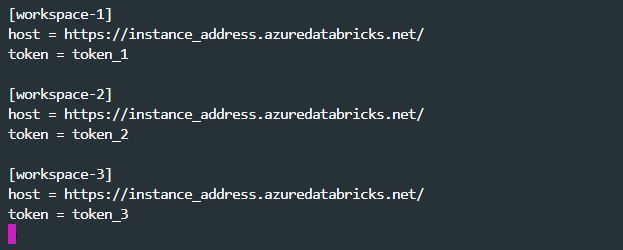

# Databricks cli CHEAT SHEET 

## Set up cli 

### install: 
`pip install databricks-cli`

### Authentication: 
- Go to databricks workspace (azure portal)
- User settings -> Access token -> Generate new token (it want be editable so dont lose it)
- on the shell: 
    - `databricks configure --profile workspace-1 --token`
    - will and an entry in: `~/.databrickscfg` (let's have a look at it) 
    

        
## Databricks cli capabilities:
Databricks can be used with the following keywords:

`databricks --profile workspace-1 ...`

    - workspace => interact with DB workspace (upload, downlaod, ls, mkdir, rm)
    - fs => interact with dbfs DB File Store i.e. DB file system, (cp, ls, mkdirs, mv, rm, cat)
    - configure => configure authentication to DB instance
    - tokens => manage user tokens (create, list, revoke) 
    - secrets => Store secrets (conn string, passwords etc.) either Azure Key Vault-backed or Databricks-backed 
              => secret management (create-scope, list, etc. ) equivalent to https://<databricks-instance>#secrets/...
    - groups => managing DB users groups (cluster creation and sql analytics)
---
    - cluster-policies => cluster policies utility (create, delete, edit, list, get)
    - clusters => managing DB clusters (create, delete, resize, etc.) 
    - libraries => manage third parties library on DB clusters (install, list, cluster specific status, etc.)
---
    - instance-pools => An instance pool reduces cluster start and auto-scaling times by maintaining a set of idle, ready-to-use cloud instances
                     => managing instance pools (create, delete, etc.)
    - jobs => A job is a non-interactive way to run an application in a Databricks cluster
           => managing jobs (create, delete, get, etc.)
    - runs => ouput of a specific job execution
           => retriev infos (cancel, get, list, submit)
---              
    - pipelines => manage DB Delta Pipelines.


## Useful examples: 

#### Upload folder to databricks
```
$ cd git_repo
$ databricks  workspace import_dir --profile workspace-1 -o source_folder/ /Users/username/name_of_the_folder_on_DataBricks
```
#### Download folder to databricks
```
$ cd local_folder
$ databricks workspace export_dir --profile workspace-1 -o /Users/username/name_of_the_folder_on_DataBricks name_of_the_folder_locally
```

#### secrets: 
Secrets used by workspace-1

list-scopes => how many Azure Key Vaults are link to your sub: `$ databricks secrets --profile workspace-1 list-scopes`  
list --scopes => how many secrets/passwords are present in a specific AKV: `$ databricks secrets --profile workspace-1 list --scope scope-workspace-1`  


#### Groups: 

List all the groups present in your workspace: `$ databricks groups --profile workspace-1 list`  
List all the members of a specific group: `$ databricks groups --profile workspace-1 list-members --group-name name_of_group`  


#### clusters:
Get the list of clusters displayed as a table: `$ databricks clusters --profile workspace-1 list --output TABLE`  
Get infos on a specific cluster: `$ databricks clusters --profile workspace-1 get --cluster-id cluster_id`  
Get events on a specific cluster (start, stop, resizing, etc.): `$ databricks clusters --profile workspace-1 events  --cluster-id cluster_id`  
Get list of available databricks nodes type: `$ databricks clusters --profile workspace-1 list-node-types`  
Get all libraries installed on all clusters: `$ databricks libraries --profile workspace-1 list`  
Install python package on a specific cluster: `$ databricks libraries --profile workspace-1 install --cluster-id cluster_id  --pypi-package pandas`  
Uninstall python package on a specific cluster (it will require restart to be effective):`$ databricks libraries --profile workspace-1 uninstall --cluster-id cluster_id  --pypi-package pandas`  
Restart a specific cluster: `$  databricks clusters --profile workspace-1 restart --cluster-id cluster_id`  


#### Instance pools: 
Instance-pools (Azure Databricks pools reduce cluster start and auto-scaling times by maintaining a set of idle, ready-to-use instances.)

List instance-pools present in the instance: `$ databricks instance-pools --profile workspace-1 list --output TABLE`
Get instance-pools infos (Node types, spark version, auto-termination, etc. ) `$ databricks instance-pools --profile workspace-1 get --instance-pool-id instance_pool_id` 

#### Jobs: 
What is a job: A job is a non-interactive way to run an application in an Azure Databricks cluster, for example, an ETL job or data analysis task you want to run immediately or on a scheduled basis.

List present jobs =>  get specific job id =>  run the job with notebook parameters => get run id => get run output. 
```
$ databricks jobs --profile workspace-1 list
$ databricks jobs --profile workspace-1 get --job-id job_id 
$ databricks jobs --profile workspace-1 run-now --job-id job_id --notebook-params '{"name": "john doe", "age": 35}'
$ databricks runs --profile workspace-1 list
$ databricks runs --profile workspace-1 get --run-id run_id
```

#### Extra: 
Create a new job based on a json file definition: `databricks --profile workspace-1 jobs create --json-file job_definition.json`  
Run the job definition: `databricks jobs --profile workspace-1 run-now --job-id job_id`  
Fetch run id results: `databricks runs --profile workspace-1 get --run-id run_id`

